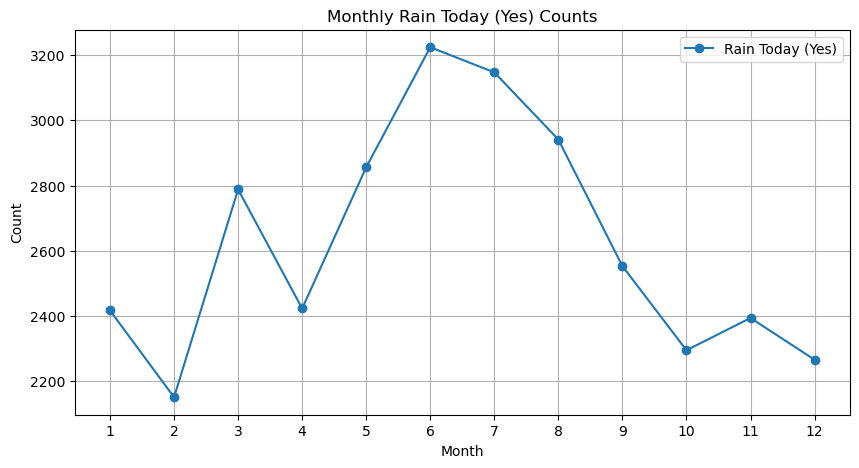
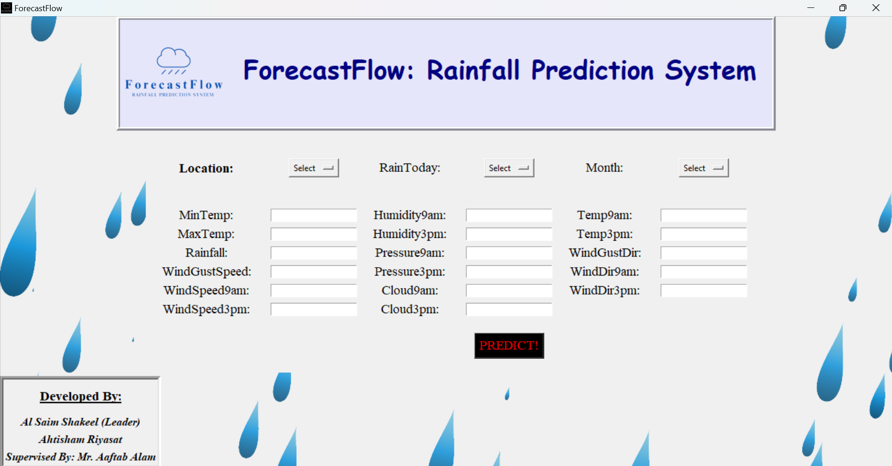

# ForecastFlow: Rainfall Prediction System


## Overview
ForecastFlow is a machine learning-based system designed to predict rainfall based on historical weather data. It utilizes data analysis and machine learning techniques to analyze various factors influencing rainfall and predict whether it will rain tomorrow.

## Dataset
The dataset used for training and testing the ForecastFlow model consists of historical weather data sourced from Kaggle. Each record includes information such as rainfall, wind direction, temperature, and humidity, along with a binary target variable indicating whether it will rain tomorrow.

Dataset:
- [Original Dataset](weatherAUS.csv)
- [Undersampled Dataset](undersampled_data.csv)

### Sample Dataset:

| Date       | Location   | Rainfall | WindGustDir | Humidity | RainTomorrow |
|------------|------------|----------|-------------|----------|--------------|
| 2008-12-01 | Canberra   | 0.6      | W           | 71.0     | Yes          |
| 2008-12-02 | Canberra   | 0.0      | WNW         | 44.0     | No           |
| 2008-12-03 | Canberra   | 0.0      | WSW         | 38.0     | No           |

### Dataset Analysis

#### Original Dataset


Given the observed imbalance in our dataset, we will employ undersampling techniques to achieve balance. This approach is particularly suitable considering the substantial size of our dataset.

#### UnderSampled Dataset 


Upon implementing undersampling, we have achieved an equal distribution of the categories "No" (0) and "Yes" (1), each with a count of 31,877. This results in a balanced dataset comprising 63,754 rows and 23 columns, which is a substantial size for our analysis.


## Meaningful Data Insights Extracted

### Data Insight 1
 


__According to this, we can say that Australia have most no of times rainfall in the 6th month i.e June between 2008 to 2017__

### Data Insight 2 
 

__According to this, we can say that Cairns got highest average rainfall in Australia between 2008 to 2017__ 

### Data Insight 3


__According to this, Australia have highest average rainfall in the 2nd month i.e Febuary between 2008 and 2017__

### Data Insight 4


__The wind direction that has the highest frequency of gust occurrences is the West. This indicates that gusty conditions are most commonly associated with winds coming from the West__


## System Design

          +----------------------------------+
          |          Read Dataset            |
          +----------------------------------+
                     |
                     v
          +----------------------------------+
          |       Handle Null Values         |
          +----------------------------------+
                     |
                     v
          +----------------------------------+
          |       Data Preprocessing         |
          +----------------------------------+
                     |
                     v
          +----------------------------------+
          |           Undersampling          |
          +----------------------------------+
                     |
                     v
          +----------------------------------+
          |     Feature Engineering          |
          +----------------------------------+
                     |
                     v
          +----------------------------------+
          |     Model Training and Testing   |
          +----------------------------------+
                     |
                     v
          +----------------------------------+
          |     Evaluate Model Performance   |
          +----------------------------------+
                     |
                     v
          +----------------------------------+
          |      Select Best Performing      |
          |           Model                  |
          +----------------------------------+
                     |
                     v
          +----------------------------------+
          |  Developing UI and Importing     |
          |     best model in UI             |
          +----------------------------------+


## Models Result Analysis

### KNN
#### Confusion Matrix & Classification Report
 

#### ROC Curve for KNN


### Logistic Regression
#### Confusion Matrix & Classification Report
 

#### ROC Curve for Logistic Regression


### XG Boost
#### Confusion Matrix & Classification Report
 

#### ROC Curve for XG Boost


### Light GBM
#### Confusion Matrix & Classification Report
 

#### ROC Curve for Light GBM


### Model Comparison


## Model Conclusion

We evaluated four different models and their respective accuracies:

| Model Name          | Accuracy (%) |
|---------------------|--------------|
| KNN Model           | 76           |
| Logistic Regression | 77           |
| XG Boost            | 80           |
| Light GBM           | 81           |

The K-Nearest Neighbors (KNN) model will not be utilized due to its comparatively lower accuracy. While the XGBoost model exhibits an impressive accuracy of 80%, its training score of 99% suggests a potential overfitting risk, so we will refrain from using it. 

Both Logistic Regression and LightGBM are viable options. However, given that LightGBM demonstrates the highest accuracy without the risk of overfitting, we will proceed with the LightGBM model.

## User Interface




## Installation
### Install the required libraries:
- numpy: Library for numerical computing in Python.
- pandas: Data manipulation and analysis library in Python.
- matplotlib: Data visualization library for creating plots and charts.
- seaborn: Data visualization library based on matplotlib, providing attractive statistical graphics.
- scikit-learn: Machine learning library for building predictive models.
- lightgbm: Gradient boosting framework for efficient tree-based learning.
- joblib: Library for saving and loading scikit-learn models.
- tkinter: GUI toolkit for building user interfaces in Python.

You can install the required libraries using the following command:
```
pip install numpy pandas matplotlib scikit-learn lightgbm joblib tkinter
```

Here's the "Usage" section for your readme.md file:

## Usage
1. Open and run the `ForecastFlow - Machine Learning.ipynb` notebook using Jupyter Notebook or JupyterLab.
2. Follow the instructions and code cells in the notebook to preprocess the data, train the model, and evaluate its performance.
3. Use the trained model to make predictions on new data.
4. (Optional) If you prefer to use the built-in user interface (UI) with tkinter:
   - The UI with tkinter has already been built and integrated into the `ForecastFlow - Front End.py` script.
   - Simply run the script to launch the UI.
   - Input the necessary data or parameters into the UI and follow the prompts to get predictions or perform other tasks.

## Project Structure
- `ForecastFlow - Machine Learning.ipynb`: Jupyter Notebook containing the code for machine learning model development and evaluation.
- `ForecastFlow - Front End.py`: Python script containing the code for the user interface (UI) development using Tkinter.
- `ForecastFlow Minor Project - PPT.pptx`: PowerPoint presentation slides for the ForecastFlow minor project.
- `ForecastFlow Minor Project - Report.pdf`: PDF document containing the report for the ForecastFlow minor project.
- `model.pkl`: Pickled file containing the trained machine learning model.
- `readme.md`: Markdown file providing an overview of the project.
- `requirements.txt`: Text file listing the dependencies required to run the code.
- `undersampled_data.csv`: CSV file containing the dataset after applying undersampling technique.
- `weatherAUS.csv`: Dataset used for training and testing the ForecastFlow model.

## Credits
- __[Al Saim Shakeel]__: Project Leader
- __[Ahtisham Riyasat]__

## Certificate
This project has been officially approved and certified by our Project Guide and the Head of Department (HOD) of the Computer Science Engineering department at Integral University, Lucknow.

[Approved Certificate](images/certificate.png)

## References
- [numpy](https://numpy.org/): Numerical computing library in Python.
- [pandas](https://pandas.pydata.org/): Data manipulation and analysis library in Python.
- [matplotlib](https://matplotlib.org/): Data visualization library for creating plots and charts.
- [Seaborn](https://seaborn.pydata.org/): Data visualization library based on matplotlib, providing attractive statistical graphics.
- [scikit-learn](https://scikit-learn.org/): Machine learning library for building predictive models.
- [lightgbm](https://lightgbm.readthedocs.io/): Gradient boosting framework for efficient tree-based learning.
- [K-nearest Neighbors (KNN)](https://scikit-learn.org/stable/modules/neighbors.html): Supervised learning algorithm used for classification and regression.
- [Logistic Regression](https://scikit-learn.org/stable/modules/generated/sklearn.linear_model.LogisticRegression.html): Linear model for binary classification tasks.
- [XGBoost](https://xgboost.readthedocs.io/en/latest/): Scalable and accurate implementation of gradient boosting machines.
- [tkinter](https://docs.python.org/3/library/tkinter.html): GUI toolkit for building user interfaces in Python.
- [joblib](https://joblib.readthedocs.io/en/latest/): Library for saving and loading scikit-learn models.

# THE END
